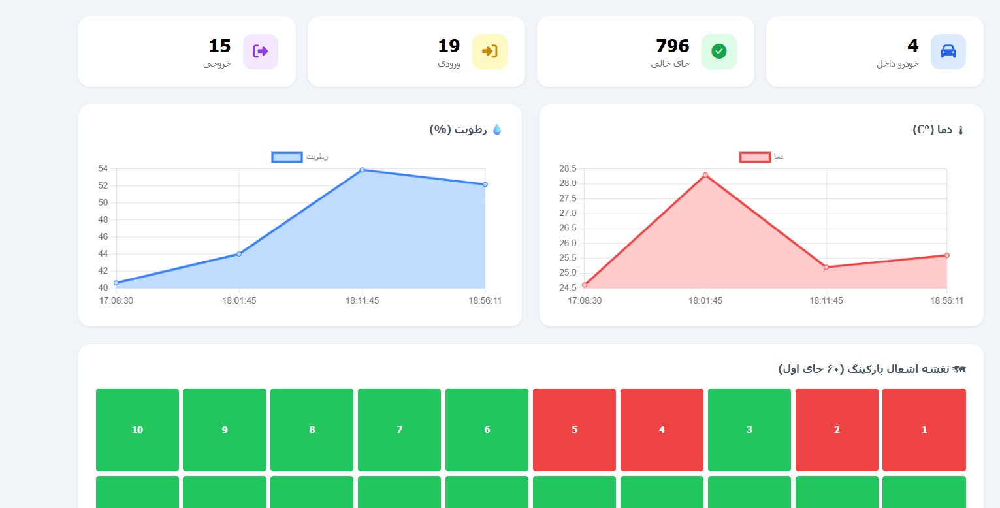
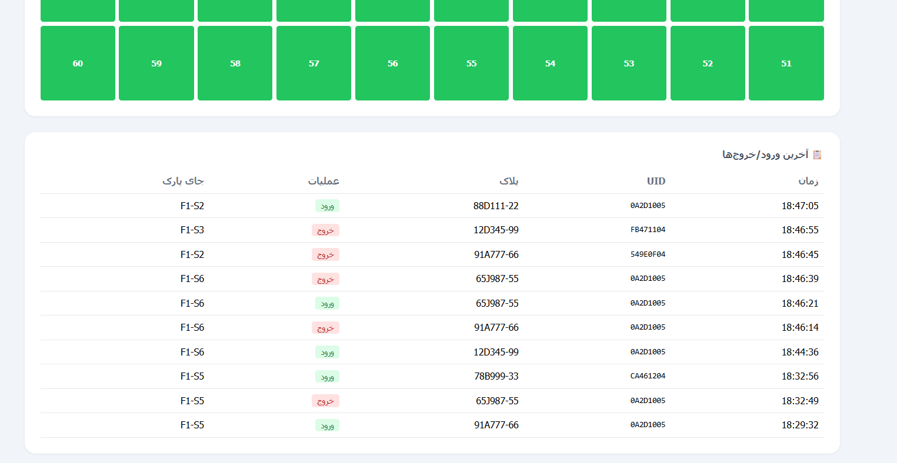

# 🚗 Smart Parking DAQ System & IoT Control

> **Course:** Instrumentation and Measurement  
> **Instructor:** Dr. Ahmad Afshar  
> **Institution:** Amirkabir University of Technology (Tehran Polytechnic) — Department of Electrical Engineering  

[](#-english-version)
[](#-%D9%86%D8%B me1%D8%AE%D9%87-%D9%81%D8%A7%D8%B1%D8%B3%DB%8C)

---

## 🌐 English Version

### 📌 Project Overview
The **Smart Parking DAQ System** is an end-to-end IoT and Instrumentation solution designed for automated multi-story parking structures. It integrates physical sensor data acquisition (RFID, Ultrasonic, Hall Effect, Temperature/Humidity, IR Break-beam), continuous-time closed-loop barrier gate control (PID-tuned servo motor), automated two-factor vehicle authentication (ANPR + RFID), and real-time telemetry streaming to a central Python web dashboard and Telegram bot.

---

### 🚀 Key Features

* **Two-Factor Vehicle Authentication:** Dual-layer verification via **RC522 13.56MHz RFID** card UID and ANPR Camera (license plate & vehicle color matching).
* **Automated Nearest-Slot Allocation:** Real-time database query prioritizing the nearest vacant parking slot ordered by floor number:
  $$\text{Target Slot} = \arg\min_{\text{floor, slot}} \{ \text{floor} \mid \text{is\_occupied} = 0 \}$$
* **Multi-Layer Hardware Redundancy:** 
  - *Dual Occupancy Sensing:* HC-SR04 Ultrasonic Distance Sensor + A3144 Hall Effect Sensor.
  - *Dual Power Supply:* Main AC Grid + Online UPS Battery Switchover.
  - *Dual Data Persistence:* Central SQLite/PostgreSQL Database + Local ESP32 EEPROM/SD Buffering during network outages.
* **Closed-Loop Servo Gate Control:** PID-controlled barrier arm ($\%OS < 5\%$, $T_s < 0.32\text{s}$) with anti-pinch IR break-beam threshold safety.
* **Interactive Web GUI & Telemetry Dashboard:** Live KPI cards, 60-slot visual occupancy grid, Chart.js environmental telemetry, and real-time access logs.
* **Proteus Simulation Integration:** Full hardware co-simulation in Proteus connected to real-time ESP32 hardware via COMPIM virtual serial port.

---

### 📊 Web Dashboard & System Results

| Real-Time KPIs, Occupancy Map & Environmental Telemetry | Live Vehicle Access Logs & Slot Grid |
| :---: | :---: |
|  |  |
| *Live counters (Inside, Vacant, Entry, Exit), 60-Slot Occupancy Grid (Green=Vacant, Red=Occupied), and Real-Time Temp/Humidity Charts.* | *Real-time access log table featuring Timestamp, UID, License Plate, Action Badge (Entry/Exit), and Allocated Slot ID.* |

---

### ⚠️ IMPORTANT: ESP32 Firmware Setup & Configuration

> [!CRITICAL]
> **Wi-Fi & Server Credentials Requirement**  
> Before flashing the microcontroller firmware located in `arduinocode/` or `rc522sevorgbwifi/`, you **MUST** update your local Wi-Fi network credentials and Central Python Server IP address inside the code file (`.ino` / `.cpp`):
>
> ```cpp
> // Update these constants with your network details:
> const char* ssid     = "YOUR_WIFI_SSID";
> const char* password = "YOUR_WIFI_PASSWORD";
> const char* serverUrl = "http://YOUR_SERVER_IP:8000/api/gate/";
> ```

---

### 📂 Repository Structure

```
smart-parking/
├── arduinocode/                      # ESP32 Main Firmware (Sensors, Servo, LCD, Wi-Fi)
├── rc522sevorgbwifi/                 # RFID & RGB LED Test Modules
├── proteus-simulation/               # Proteus Hardware Co-Simulation Files (.pdsprj)
└── report/                           # Engineering Documentation & Reports
    ├── dashboard-kpi-occupancy-telemetry.jpg
    ├── dashboard-live-access-logs.jpg
    ├── instr-parking-final-report.pdf    # Complete Report (Persian)
    └── instr-parking-final-report-en.pdf # Complete Report (English)
```

---

### 📖 Full Documentation
For in-depth mathematical modeling, PID transfer functions, signal processing circuits (10kΩ pull-up justifications), and Purdue security architectures, refer to the full PDF reports in the `report/` directory.

---

<br>

---

## 🇮🇷 نسخه فارسی

<details>
<summary><b>👇 برای مشاهده بخش‌های کامل نسخه فارسی اینجا کلیک کنید</b></summary>

<br>

### 📌 معرفی پروژه
پروژه **سامانه ابزار دقیق و اتوماسیون پارکینگ هوشمند** یک راهکار کامل اینترنت اشیاء (IoT) برای مدیریت پارکینگ‌های طبقاتی است. این سیستم شامل جمع‌آوری داده از حسگرهای مختلف (RFID، اولتراسونیک، اثر هال، دما و رطوبت، مادون قرمز)، کنترل حلقه-بسته زمان پیوسته بازوی گیت (کنترل‌کننده PID موتور سروو)، احراز هویت دو مرحله‌ای خودرو (تگ RFID + تصویر پلاک)، و ارسال تله‌متری آنلاین به سرور پایتون و ربات تلگرام است.

---

### 🚀 ویژگی‌های کلیدی سیستم

* **احراز هویت دو مرحله‌ای خودرو:** شناسایی همزمان تگ RFID (فرکانس ۱۳.۵۶MHz) و تطبیق پلاک/رنگ خودرو با دوربین.
* **تخصیص هوشمند نزدیک‌ترین جایگاه خالی:** کوئری آنلاین روی پایگاه داده بر اساس شماره طبقه صعودی جهت کاهش پیمایش خودرو:
  ```sql
  SELECT floor, slot_number FROM parking_slots 
  WHERE is_occupied = 0 
  ORDER BY floor ASC, slot_number ASC LIMIT 1;
  ```
* **معماری افزونگی چندلایه‌ای (Redundancy):**
  - *تشخیص دوگانه حضور:* حسگر اولتراسونیک HC-SR04 + حسگر مغناطیسی اثر هال A3144.
  - *تغذیه دوگانه:* برق اصلی شهر + سوئیچ خودکار به باتری پشتیبان UPS.
  - *ذخیره‌سازی دوگانه:* پایگاه داده سرور + بافر محلی EEPROM/SD کارت در زمان قطعی شبکه.
* **کنترل حلقه-بسته گیت (PID):** کنترل زاویه بازوی سروو با فراجهش کمتر از ۵٪ و زمان نشست زیر ۰.۳۲ ثانیه همراه با حسگر ایمنی IR Break-beam.
* **داشبورد وب و گرافیکی (GUI):** کارت‌های آمار زنده، نقشه گرافیکی ۶۰ جایگاه اول، نمودارهای زمان‌حقیقی دما/رطوبت و جدول لاگ‌های ورود و خروج.
* **شبیه‌سازی کامل در پروتئوس:** اتصال مستقیم شبیه‌ساز Proteus به برد واقعی ESP32 از طریق پورت سریال مجازی (COMPIM).

---

### 📊 نتایج عملکرد و داشبورد وب

| کارت‌های آمار زنده، نقشه جایگاه‌ها و تله‌متری محیطی | جدول لاگ ورود/خروج و وضعیت جایگاه‌ها |
| :---: | :---: |
|  |  |
| *نمایش تعداد خودروهای داخل، جایگاه‌های خالی، نمودار لحظه‌ای دما و رطوبت و نقشه ۶۰ جایگاه اول (سبز=خالی، قرمز=اشغال)* | *جدول لاگ زنده ورود و خروج به همراه زمان دقیق، UID کارت، پلاک خودرو، نوع عملیات و شماره جایگاه تخصیصی* |

---

### ⚠️ هشدار مهم: تنظیمات اطلاعات وای‌فای و سرور روی ESP32

> [!IMPORTANT]
> **نیاز به تنظیم اطلاعات شبکه**  
> قبل از پروگرم کردن میکروکنترلر در پوشه‌های `arduinocode/` یا `rc522sevorgbwifi/`، **باید** اطلاعات شبکه وای‌فای و آدرس IP سرور پایتون خود را در کد (`.ino` / `.cpp`) وارد نمایید:
>
> ```cpp
> // اطلاعات وای‌فای و سرور خود را اینجا وارد کنید:
> const char* ssid     = "نام_وای_فای_شما";
> const char* password = "رمز_وای_فای_شما";
> const char* serverUrl = "http://YOUR_SERVER_IP:8000/api/gate/";
> ```

---

### 📖 گزارش‌های کامل مهندسی
گزارش‌های جامع شامل فرمول‌های ریاضی، تابع تبدیل موتور سروو، طراحی مدارات پردازش سیگنال (دلیل فنی مقاومت ۱۰kΩ Pull-up) و فلوچارت‌های کامل سیستم در پوشه `report/` با دو فرمت PDF فارسی و انگلیسی در دسترس هستند.

</details>

---

**Amirkabir University of Technology — Electrical Engineering Department**
